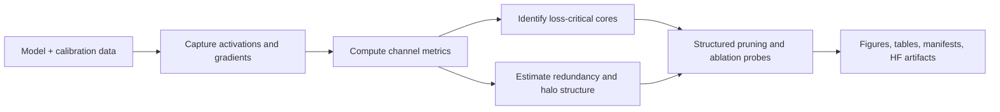

# LossLens

Loss-sensitive neural network analysis and structured pruning tools.

[](https://github.com/KempnerInstitute/alignment/actions/workflows/test.yml)
[](https://github.com/KempnerInstitute/alignment/actions/workflows/lint.yml)
[](https://github.com/KempnerInstitute/alignment/actions/workflows/docs.yml)
[](https://github.com/KempnerInstitute/alignment/actions/workflows/release.yml)
[](pyproject.toml)
[](https://huggingface.co/datasets/hsafaai/supernodes-scar-artifacts)
[](LICENSE)

LossLens is a research codebase for studying which channels, neurons, and
features matter most for model behavior. The current Python package is imported
as `alignment` for backward compatibility.

The repository supports two related workflows:

- General metric analysis for vision models, transformers, and LLMs.
- Paper-specific releases under `projects/`, including the Supernodes and SCAR
  artifact workflow.

## What The Code Does



Core capabilities:

- Loss-sensitive channel scoring, including SCAR loss-proxy metrics.
- Activation, curvature, Taylor, Rayleigh quotient, and information-theoretic metrics.
- Structured pruning strategies for channel-level model analysis.
- Cluster and halo-style analyses for local redundancy structure.
- Reproducible project folders for paper artifacts and public releases.

Supported model families include MLPs, CNNs, transformer language models, and
LLM backends through Hugging Face causal language models.

## Installation

```bash
git clone https://github.com/KempnerInstitute/alignment.git
cd alignment
conda env create -f environment.yml
conda activate alignment
pip install -e .
```

For documentation and optional analysis tools:

```bash
pip install -e .[all]
```

## Quick Start

```bash
# Vision model analysis
python scripts/run_experiment.py --config configs/examples/mnist_basic.yaml

# CNN pruning
python scripts/run_experiment.py --config configs/vision_prune/resnet18_cifar10_full.yaml

# LLM supernode and SCAR analysis
python scripts/run_experiment.py --config configs/prune_llm/llama3_8b_unified.yaml
```

Package the public Supernodes and SCAR artifacts:

```bash
python projects/supernodes_scar/scripts/prepare_hf_artifacts.py \
  --output-dir outputs/supernodes_scar_hf \
  --clean

python projects/supernodes_scar/scripts/verify_hf_artifacts.py \
  outputs/supernodes_scar_hf
```

## Paper Releases

Paper-specific release material lives under `projects/`. Reusable library code
stays in `src/alignment`, while each project folder records the exact configs,
artifact layout, reproducibility notes, and release checklist for a paper.

Current project:

- `projects/supernodes_scar/`: release material for "Supernodes and Halos:
  Loss-Critical Hubs in LLM Feed-Forward Layers".

Derived artifacts for this project are staged on Hugging Face:

- `https://huggingface.co/datasets/hsafaai/supernodes-scar-artifacts`

## Main Concepts

| Area | Examples |
|------|----------|
| Activation metrics | `activation_l2_norm`, `activation_variance`, `activation_outlier_index` |
| Alignment metrics | `rayleigh_quotient`, `delta_alignment` |
| Information metrics | `mutual_information_gaussian`, `pairwise_redundancy_gaussian`, `gaussian_pid_synergy_mmi` |
| SCAR metrics | `scar_activation_power`, `scar_taylor`, `scar_curvature`, `scar_loss_proxy` |
| Pruning strategies | `magnitude`, `alignment`, `composite`, `cluster_aware`, `random` |

## Repository Layout

```text
alignment/
|-- configs/
|   |-- prune_llm/          # LLM and SCAR configs
|   |-- vision_prune/       # Vision pruning configs
|   `-- examples/           # Small example configs
|-- projects/               # Paper-specific release material
|-- scripts/
|   |-- run_experiment.py   # Main experiment entry point
|   `-- run_analysis.py     # Post-hoc analysis
|-- src/alignment/
|   |-- analysis/           # Visualization, clustering, cascade analysis
|   |-- experiments/        # Experiment classes
|   |-- metrics/            # Importance metrics
|   |-- models/             # Model wrappers
|   `-- pruning/            # Pruning strategies
|-- tests/                  # Unit tests
`-- docs/                   # Documentation
```

## Documentation

- [Usage Guide](docs/usage.md)
- [API Reference](docs/api_reference.md)
- [LLM Guide](docs/llm_guide.md)
- [Metric Consistency](docs/METRIC_CONSISTENCY.md)
- [Supernodes and SCAR Release Notes](projects/supernodes_scar/README.md)

Build the Sphinx docs locally:

```bash
cd docs
make html
```

## Testing

```bash
pytest tests/
pytest tests/unit/ -v
```

## Citation

If you use the Supernodes and SCAR release, please cite the paper and the
archived code/artifact versions listed in `CITATION.cff`.

## License

This repository is released under the MIT license. See [LICENSE](LICENSE).
