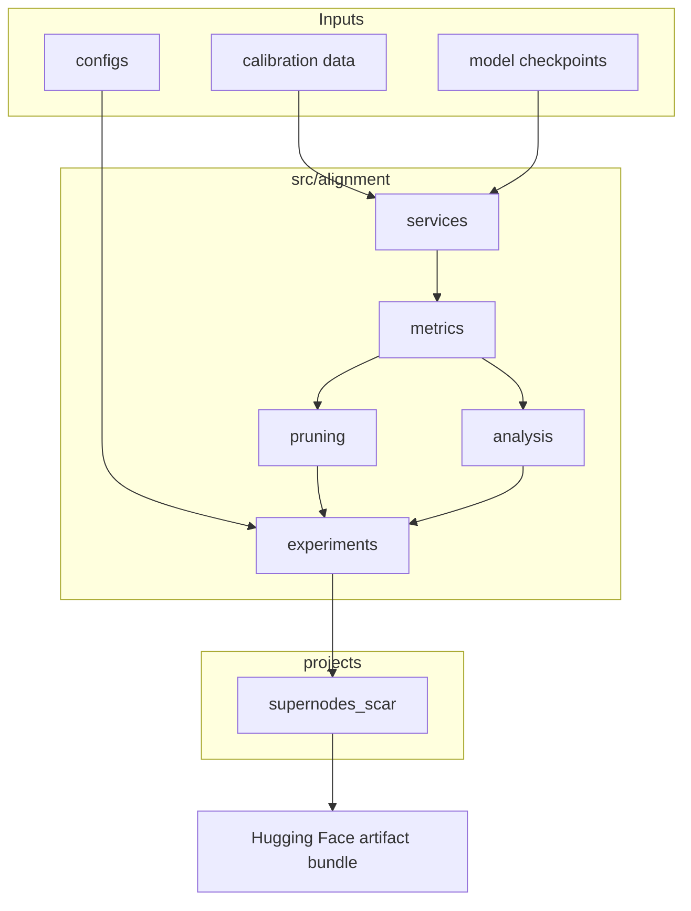
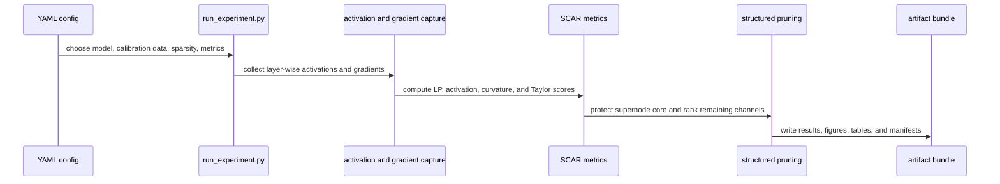

# Architecture

LossLens is organized as a reusable library plus paper-specific project
folders. The library code should remain general; each paper folder should only
contain release notes, configs, and artifact packaging scripts for that paper.

## Design Rules

- Keep reusable metrics, services, pruning code, and experiment classes in
  `src/alignment/`.
- Keep paper release instructions and packaging scripts in `projects/`.
- Keep generated outputs in `outputs/`, which is ignored by git.
- Do not store model weights, raw datasets, cluster logs, or private paths in
  the repository.
- Use project manifests and checksums for anything uploaded as an artifact.

## Supernodes and SCAR Flow

